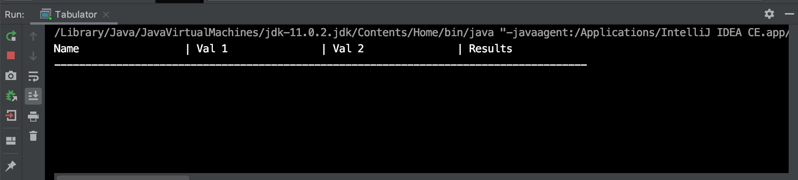
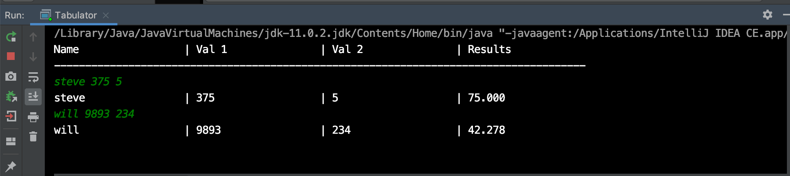
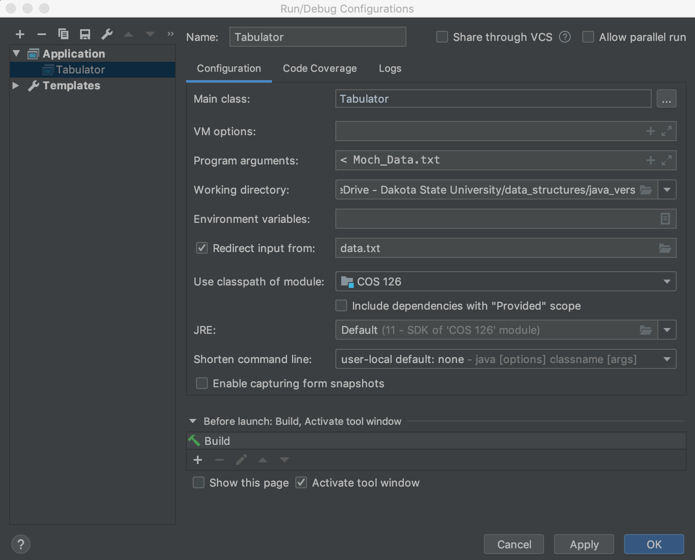

# 1.1 Exercise 1

This exercise is based on Algorithms Fourth Edition exercise 1.1.21 found on page 58. The goal of this exercise is to familiarize yourself with the Java environment and perform some simple data manipulation. For this exercise you will need to write a program that reads data from standard input, where each line contains a name and two integers. You should then print a table with a column of the names, the two integers, and the result of dividing the first integer by the second integer accurate to three decimal places. 

For example we may have a text file that contains our input data called `data.txt`. This file contains multiple lines of data where each line consists of a name and two integer values. An example of this file's contents may look like

```
Nettle	40836	6408
Rupert	25607	1287
Brodie	79063	5780
Osborne	2118	7215
Corrie	7000	1744
Minda	42943	9775
Ulysses	102	7267
Leoline	15734	1981
Emelyne	20238	7958
Husain	27236	511
Delmar	38486	138
Aldous	35152	5073
Phebe	39956	8772
Elsbeth	17202	8577
Alana	26236	1945
Page	96911	3966
```

We will then invoke our program which will read this file from stdin and process the values and print our table. An example invokation would look like

```shell
% java Tabulator < data.txt
```

Note the use of the `<` character. In this instance we are not passing our program any arguments, but are instead echoing the contents of our file, `data.txt`, to standard in. This has the same behavior as us manually typing the contents of the file into the command line after executing the program which allows us to test with far larger data sets then we would otherwise be able to.

The program should then provide the following output

```

Name                 | Val 1               | Val 2               | Results
--------------------------------------------------------------------------------------
Nettle               | 40836               | 6408                | 6.373
Rupert               | 25607               | 1287                | 19.897
Brodie               | 79063               | 5780                | 13.679
Osborne              | 2118                | 7215                | 0.294
Corrie               | 7000                | 1744                | 4.014
Minda                | 42943               | 9775                | 4.393
Ulysses              | 102                 | 7267                | 0.014
Leoline              | 15734               | 1981                | 7.942
Emelyne              | 20238               | 7958                | 2.543
Husain               | 27236               | 511                 | 53.299
Delmar               | 38486               | 138                 | 278.884
Aldous               | 35152               | 5073                | 6.929
Phebe                | 39956               | 8772                | 4.555
Elsbeth              | 17202               | 8577                | 2.006
Alana                | 26236               | 1945                | 13.489
Page                 | 96911               | 3966                | 24.435
```

## Using Intelij

The repository includes a project file which allows you to open the exercise and run it in Intelij. To use Intelij, `git clone` the exercise to a location where you want to work on it. Then open Intelij and select the `open` option, then select the exercise directory that you just `clone`d. Note you must use `open` and not `import`. 

Once opened, you may edit and run your code in the editor. To build and run your code you can use the keyboard shortcut `ctrl`+`shift`+`R`. After building, a new window will open on the screen showing the output from the program. 



Note that since this program is reading input from stdin nothing will happen until you begin to type data, in the correct format, into the terminal.



This allows you to manually enter and test data. If you want to use data that is contained in a data file then you need to select `Run`->`Edit Configurations` from the menu bar. Then in the new window, check the box which says `Redirect input from:` and provide the path to your data file



Now, when you issue `ctrl`+`shift`+`R` the contents of your data file should be echo'd to your program. 

## Requirements

This template includes skeleton code which you may use as a starting point for this exercise. Your output should match the output found in `target_output.txt` exactly, this includes whitespaces and casing. Once you have completed the exercise make sure to commit your changes to the repository and push back to GitHub. 

## Hints

You will want to make use of some of the text's built in library functions to complete this task. Three very useful functions will include

- StdOut.printf: Allows you to print a formatted string of data, just like C
- StdIn.read[Double/String]: Reads a String or a double from standard in 
- StdIn.isEmpty: Check to see if there is more data on standard in that should be read

The [companion website](https://introcs.cs.princeton.edu/java/15inout/index.php#1.5) includes multiple examples of how to use these functions. Remember, if you use these functions you must either build and run your code in Intelij with the provided project or use the `java-algs4` and `javac-algs4` from the command line. 